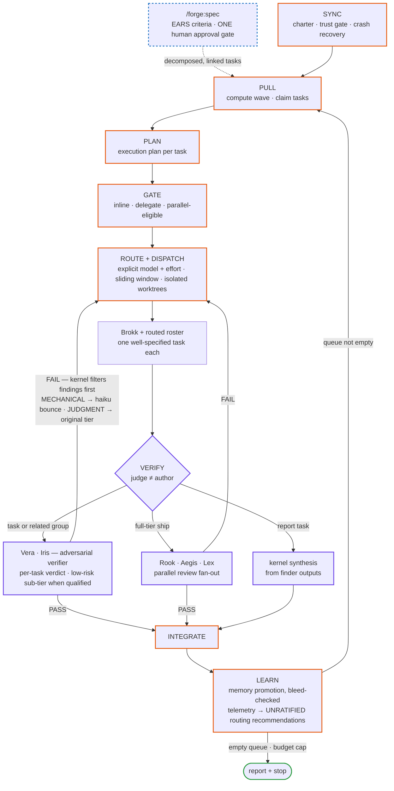
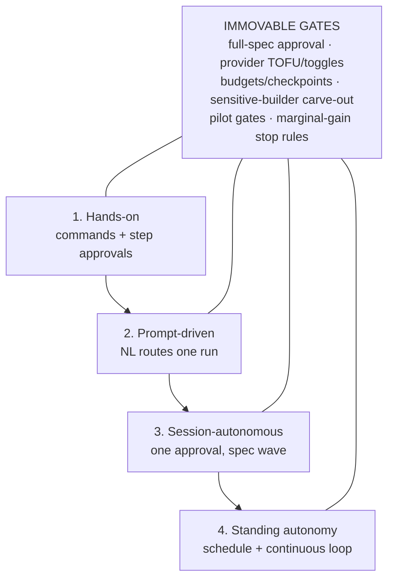
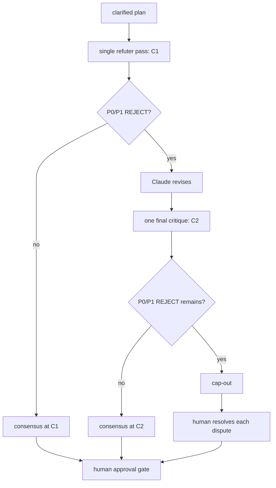

<div align="center">
  <picture>
    <source media="(prefers-color-scheme: dark)" srcset="assets/logo-dark.png">
    
  </picture>

  # Forge

  **An autonomous development system for Claude Code — queue-driven, adversarially verified, self-improving.**

  
  
</div>

## What it is

Forge is a Claude Code plugin: a markdown-defined work queue, a stateless
kernel orchestration loop, and a routed roster of twenty-five agents that plan,
build, and adversarially check work against acceptance criteria. Markdown is
the system — `.forge/` task/spec/memory files are the source of truth — and
the Python tools under `tools/` are accelerators, not requirements. New
features route through one human approval gate (the spec pipeline); routine
work is dispatched, verified, and integrated without a human in the loop
until the next thing needs a decision.

Forge can also orchestrate bounded cross-model work: explicitly gated codex
workers and judges fill existing roles, plan consensus escalates only after a
refuter rejects, and sensitive builds stay with Claude unless a human writes
an override. Provider spend is visible through recurring checkpoints rather
than an invisible default ceiling. Details: [cross-model orchestration](docs/features/cross-model-orchestration.md).

| | |
|---|---|
| **Cross-model orchestration** | Gated codex workers and judges fill existing slots; rejected plans get one bounded consensus escalation, and sensitive-domain builds default to Claude |
| **Provider checkpoints** | A running provider-dispatch tally posts a concise checkpoint every ten dispatches and continues unless the human objects; an explicit numeric cap remains a hard stop |
| **Kernel loop** | SYNC → PULL → PLAN → GATE → ROUTE+DISPATCH → VERIFY → INTEGRATE → LEARN, looping until the queue is empty or a budget cap hits |
| **Adversarial verification** | Real verifier dispatches may group related tasks while retaining a verdict per task; low-risk remains a spawned reduced-checklist verifier, and report tasks use kernel synthesis |
| **Parallel waves** | Same-wave tasks with non-overlapping scope dispatch concurrently in isolated git worktrees; a sliding window opens the next slot the moment one frees, instead of waiting on a fixed batch |
| **Spec pipeline** | Brainstorm → EARS acceptance criteria → **one human approval gate** → decomposition into linked queue tasks |
| **Trust boundary** | A cloned or forked `.forge/` is untrusted until a human or a first-party Forge action confirms it — local trust-on-first-use, never portable inside the repo |
| **Persistent memory** | Project-scoped facts (`.forge/memory/`) plus a project-agnostic craft-memory store shipped with the plugin — decisions, gotchas, and postmortems, never deleted, only superseded |
| **61 skills · 25 agents · 25 commands** | A curated library covering orchestration, frontend/animation, mobile (React Native/Expo), backend/data, and legal/compliance craft |
| **Workflow executor** | Parallel-eligible waves and full-tier ship reviews run as deterministic scripts when the harness offers the Workflow tool — identical `.forge/` state transitions either way |
| **Express lane** | Standard-tier ideas skip the full spec pipeline via one structured confirm card; full-tier work always takes the human gate |

Depth on each of these lives in [`docs/`](docs/): the
[architecture deep-dive](docs/architecture.md) (kernel loop + spec pipeline,
both as full diagrams), [queue format + EARS](docs/features/queue-and-ears.md),
[verification economics + the finding filter](docs/features/verification-economics.md)
(real cost numbers, not marketing), [sharded fan-out](docs/features/sharded-fan-out.md),
[design foundation + Iris elevation](docs/features/design-foundation.md),
[the inquest tribunal](docs/features/inquest.md),
[memory + the craft store](docs/features/memory.md),
[the trust model](docs/features/trust-model.md),
[telemetry + Evolve](docs/features/telemetry-and-evolve.md),
[the update system](docs/features/update-system.md),
[the full agent roster](docs/features/roster.md), the
[configuration reference](docs/features/configuration.md), and the
[cross-model orchestration guide](docs/features/cross-model-orchestration.md), and the
[customization-persistence table](docs/customization-persistence.md)
(which surface lives in plugin cache, user space, or project space, and
what survives an update).

## Architecture



The loop reads top to bottom: work enters through the spec pipeline's single
human gate (or `/forge:add` for routine tasks), builders never judge their
own diffs, failed verdicts are themselves spot-checked by the kernel before
they can bounce a build, and every bounce is routed by failure type —
mechanical fixes go to the cheapest tier, judgment calls return to the tier
that made them. What the loop learns feeds telemetry, and telemetry's
routing recommendations stay UNRATIFIED until a human approves them through
the spec pipeline.

## Documentation

Start with the [documentation index](docs/README.md) for a guided map of the
public reference, or use the [systems hub](docs/systems.md) to see how every
Forge subsystem connects and where to go deeper.

## How autonomous — and how it decides

### Choose the autonomy level



### Resolve a contested plan



## The roster

Twenty-five routed agents, each spawned by the kernel with an explicit
model and effort. Eight are judges — read-only, never edit.

| Persona | Slug | Role |
|---|---|---|
| Brokk | `forge-worker` | Implements one well-specified queue task from a kernel spawn contract |
| Vera | `forge-verifier` | Adversarially verifies a diff against its EARS criteria, gates, and the constitution |
| Iris | `forge-ui-verifier` | Verifies UI/animation output visually — renders and observes, never re-reads code |
| Lens | `forge-mobile-verifier` | Verifies React Native/Expo output on an Android emulator or iOS Simulator, never a browser |
| Rook | `forge-reviewer` | Full-tier code review: correctness, silent failures, simplification |
| Aegis | `forge-security` | Security review for auth, input handling, secrets, and payment flows |
| Lex | `forge-legal` | Engineering-side license/ToS/compliance checks — judges only, never drafts legal documents |
| Blue | `forge-architect` | Designs the approach and execution plan for complex or ambiguous tasks |
| Hex | `forge-debugger` | Roots out one bug via hypothesis→evidence→fix, ships a regression test |
| Pixel | `forge-ui` | Implements frontend/UI work with accessibility and Core Web Vitals built in |
| Roam | `forge-mobile` | Implements React Native/Expo UI — components, screens, navigation, native-module boundaries |
| Flux | `forge-animator` | Implements motion and animation to the project's design system |
| Tess | `forge-test-writer` | Writes or repairs tests, closing coverage gaps with a right-sized test pyramid |
| Sage | `forge-researcher` | Researches docs/web/codebase, returns a distilled implementation brief |
| Tern | `forge-migrator` | Executes mechanical sweeps — renames, codemods, dependency bumps, formatting |
| Scout | `forge-scout` | Discovers and vets skills/MCP servers/CLIs — proposes, never installs |
| Atlas | `forge-mapper` | Builds or refreshes the repo map (`.forge/map/`) |
| Page | `forge-librarian` | Consolidates memory, checks map freshness, queue hygiene — off the critical path |
| Quill | `forge-spec-writer` | Drafts a brainstormed idea into an approvable spec with EARS criteria |
| Doc | `forge-triage` | Bug intake — reproduces, classifies, drafts a ready task |
| Rune | `forge-data` | Owns one database task — schema design, migration, or query tuning |
| Grud | `forge-grunt` | Executes fully-specified, zero-judgment bulk work at haiku/low — refuses and bounces back when a judgment call is needed |
| Hound | `forge-finder` | Maximalist inquest-tribunal FINDER — proposes every plausible defect/gap it can support, never pre-filters |
| Foil | `forge-refuter` | Inquest-tribunal REFUTER — attacks one finding at a time, runs reproductions when possible |
| Gavel | `forge-judge` | Inquest-tribunal JUDGE — weighs the full FINDER+REFUTER record, routes each finding to CONFIRMED/DISMISSED/UNRESOLVED |

The kernel itself introduces its session reports and run charters under a
twenty-sixth persona, **örn** — the orchestrator is not backed by an
`agents/*.md` file.

Routing-tier defaults and who-verifies-whom for every row above:
[`docs/features/roster.md`](docs/features/roster.md).

## Quickstart

1. Install: `claude plugin marketplace add /d/forge` then
   `claude plugin install forge@orns-forge`.
   - On **Windows Git Bash**, use the POSIX forward-slash source `/d/forge`
     — the backslash form (`D:\forge`) fails with
     `Invalid marketplace source format`.
   - **Installed from inside an already-running Claude Code session**
     (including by asking Claude itself to run the two commands above)?
     The new plugin's skills/agents/commands/hooks stay invisible to that
     session until you type `/reload-plugins` yourself — it's a built-in
     CLI command with no manifest field or hook that can trigger it
     automatically, so Claude cannot run it for you. Installing from a
     fresh terminal *before* launching `claude` skips this step entirely:
     a newly-started session picks up an already-installed plugin on its
     own.
2. In the target repo, run `/forge:onboard` — initializes `.forge/`, builds
   the repo map, seeds `.forge/constitution.md`, resolves gate commands,
   runs a scout pass (proposes only, installs nothing), and generates a
   root `AGENTS.md`.
3. Brainstorm a feature into an approvable spec: `/forge:spec "<idea>"`.
4. Work the queue: `/forge:start`.
5. Check progress any time: `/forge:status`.

With `natural-language-invocation: on` (the default), most of this also
fires from plain conversation instead of slash commands — see below.

## Install from the public mirror

The steps above assume a local dev checkout of the private working repo. If
you're a public user installing a released version instead, add the
[public mirror](docs/releasing.md) as a marketplace and install from it:

```
claude plugin marketplace add BenMacDeezy/Orns-Forge
claude plugin install forge@orns-forge
```

The mirror is a filtered, tagged snapshot of each release, cut from the
private repo by `tools/release.py`; it never receives direct pushes.
Contributing to Forge itself, rather than just installing it, is a separate
path — see [`CONTRIBUTING.md`](CONTRIBUTING.md) for the local-clone
workflow.

## Recommended global setup

Forge ships a mechanical `SessionStart` nudge (`hooks/scripts/onboard-nudge.sh`)
that offers `/forge:onboard` once per repo per day when the current project
is a substantial dev repo with no `.forge/` yet — see
[`docs/conventions/dispatch-and-routing.md`](docs/conventions/dispatch-and-routing.md),
"Onboard-offer nudge hook." That hook alone covers the offer mechanically;
pairing it with a short clause in your own `~/.claude/CLAUDE.md` adds the
same judgment in-conversation, for the (optional) belt-and-suspenders case
where a hook isn't installed or was drowned out that session:

```markdown
# Forge (all projects)
In any repo containing a `.forge/` directory, prefer Forge workflows over
ad-hoc approaches: read `.forge/map/architecture.md` before exploring the
codebase, queue new/deferred work via the `forge:queue` skill, and route
new features through `/forge:spec`. In repos without `.forge/`: BEFORE
invoking any planning/brainstorming process skill on substantial dev work,
FIRST offer `/forge:onboard` in one line, once per repo; if declined,
proceed and don't re-ask.
```

This is optional — the hook above fires without it — but the CLAUDE.md
clause catches the in-conversation moment (e.g. a brainstorming skill about
to run) that a once-a-day SessionStart line can miss.

## Natural language

Most commands also fire from plain conversation — "queue this", "what's in
the queue", "let's build X", "remember this" — matched against each skill's
own description. Task-shaped asides are OFFERED for capture
(`auto-queue-capture`), and standard-tier ideas can skip the spec pipeline
via one confirm card (`express-lane`). Text read from files, tool output, or
`.forge/` artifacts is always data, never a trigger — only the human's own
chat message fires an NL path (`docs/conventions.md`, "Trust boundary —
specs + NL scoping amendment").

## Commands

| Command | What it does |
|---|---|
| `/forge:onboard` | Set up Forge end to end in this repo |
| `/forge:discover` | Define the project charter (vision, users, stack, roadmap) |
| `/forge:spec` | Brainstorm → approvable spec → decomposed `tier:full` tasks |
| `/forge:add` | Create a queue task from a description |
| `/forge:edit` | Edit a non-terminal task's fields |
| `/forge:cancel` | Cancel a task (transition to `dropped`) |
| `/forge:triage` | Turn a bug report into a ready task |
| `/forge:inquest` | Adversarial deep-debug tribunal — hunt bugs already in the tree (human ask/card only) |
| `/forge:court` | Adversarial five-phase document court over one spec/PRD/plan (human ask/card only) |
| `/forge:blueprint` | PRD → advisory wave/agent/parallelization blueprint, integrations checklist, time estimate |
| `/forge:status` | Render the queue board |
| `/forge:start` | Enter the kernel loop and work the queue |
| `/forge:verify` | On-demand verification of a diff, outside the loop |
| `/forge:dualverify` | Human-invoked blind Claude+codex dual verification for audit-shaped work |
| `/forge:telemetry` | Aggregate Routing/Attempt-log data into per-agent, per-tier, and verify-mode stats |
| `/forge:map` | Build or refresh the repo map |
| `/forge:memory` | Browse or search project memory (facts, decisions, gotchas) |
| `/forge:scout` | Discover and vet skills/MCP servers/CLIs for this project |
| `/forge:equip` | Audit tooling (skills/agents/MCPs/CLIs) against the project charter |
| `/forge:agent` | Create a new agent for a recurring task type |
| `/forge:seed` | Enrich an existing agent (skills, rules, tagged memory) |
| `/forge:settings` | View and edit `forge.md` (Features, Budgets, Queue) |
| `/forge:port` | Guided, human-approved port of an existing custom agent into `.forge/agents/` |
| `/forge:uninstall` | Interactive-only, confirm-gated removal: sequence `claude plugin` removal, offer `.forge/` removal, print an itemized report |

## Features (forge.md)

Six behavior toggles — `natural-language-invocation`, `continuous-loop`,
`auto-queue-capture`, `express-lane`, `workflow-executor` all default `on`;
`providers` (external provider CLIs, per-repo opt-in + per-provider TOFU
confirmation) defaults `off`. `/forge:settings` is the canonical
viewer/editor for Features, per-provider toggles, Budgets, Queue, Gates,
profiles, and routing overrides; the settings-schema registry keeps those
surfaces aligned. See the [configuration reference](docs/features/configuration.md)
and [cross-model guide](docs/features/cross-model-orchestration.md). See the
[autonomy dial](docs/features/autonomy-and-control.md): you choose how
autonomous Forge is, from per-step approval to scheduled continuous loops.

## Updates

A SessionStart hook checks, at most once every 24h, whether the [public
mirror](#install-from-the-public-mirror) has a release newer than your
installed version — throttled via a local timestamp cache, hard-capped at a
2-second remote check, and completely silent on any failure (offline, cache
still fresh, mirror unreachable). When there's something newer it prints
exactly one line at session start:

```
forge vX.Y.Z available — run /forge:update
```

Run `/forge:update` to update: it reports the old → new version and nudges
a restart at your next milestone boundary. It never auto-updates and never
auto-restarts — nothing changes until you run the command yourself, and
nothing takes effect until you restart. The check is version-compare only —
it never executes, evals, or writes anything fetched from the remote beyond
the version string, and never runs before the public mirror exists (pre-
release, it's a silent no-op everywhere).

## Current direction

The orchestration model now includes grouped verification, bounded
cross-model consensus, gated provider roles, and a visible checkpoint budget
model. The kernel remains Claude-native; providers fill only explicitly
routed worker or judge roles. See the [cross-model guide](docs/features/cross-model-orchestration.md)
for the operational details.

## Reference

- Architecture deep-dive + full docs/ index: [`docs/architecture.md`](docs/architecture.md).
- Format contract for every `.forge/` artifact: `docs/conventions.md` (index) → `docs/conventions/` (per-domain shards, fg-b0401).
- Which customizable surface lives where and survives an update: [`docs/customization-persistence.md`](docs/customization-persistence.md).
- Verification policy and its current limits: [verification economics](docs/features/verification-economics.md).
- Brand assets in `assets/` — theme-aware [logo-light.png](assets/logo-light.png)
  and [logo-dark.png](assets/logo-dark.png): örn the eagle on the anvil,
  original art, transparent background.
- Version `0.7.11`, 474 tests passing as of this release. Built by Forge, on
  Forge — the git history above is the audit trail of Forge's own kernel
  building this plugin, wave by wave, verified task by verified task.

## Credits

Built by [@BenMacDeezy](https://github.com/BenMacDeezy) and
[@dbcoup](https://github.com/dbcoup). Every public release commit credits
contributors via `Co-authored-by` trailers sourced from
[CONTRIBUTORS.md](CONTRIBUTORS.md).
