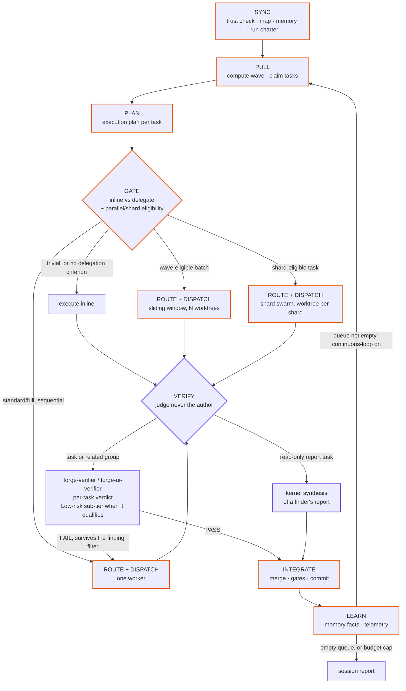
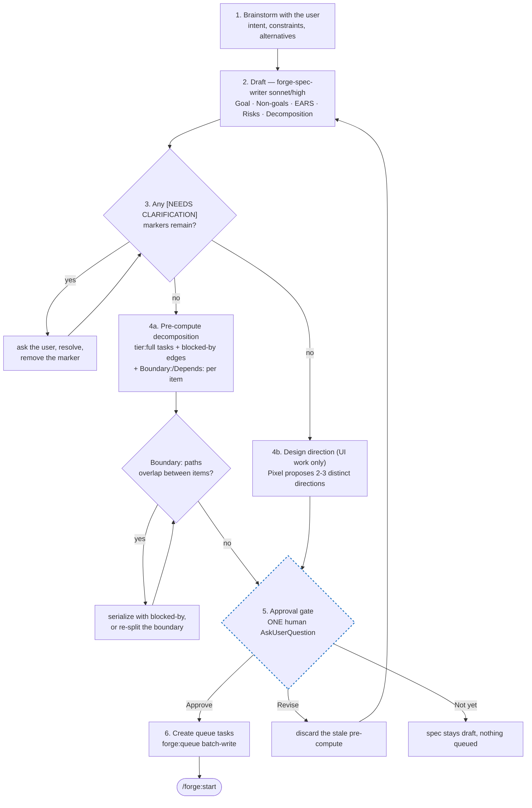

# Architecture deep-dive

This page is the depth companion to the README's headline diagram. It
covers the two systems that make up the Forge orchestration model — the
**kernel loop** (routine work) and the **spec pipeline** (new features, the
one human gate) — plus how they hand off to each other. Everything here
describes shipped behavior; nothing marked as current is speculative. For
in-progress design work, see [Roadmap](../README.md#roadmap).

Format contract for every artifact these systems read and write:
[`docs/conventions.md`](conventions.md). Kernel mechanics in full:
[`skills/kernel/SKILL.md`](../skills/kernel/SKILL.md) and
[`skills/kernel/references/parallel-dispatch.md`](../skills/kernel/references/parallel-dispatch.md).
Spec mechanics in full: [`skills/spec/SKILL.md`](../skills/spec/SKILL.md).

## Subsystems

- **Kernel** (`skills/kernel/`) — the stateless orchestration loop. Reads
  `.forge/`, dispatches agents, writes `.forge/` back. Never itself edits
  source files.
- **Queue** (`skills/queue/`, `.forge/queue/tasks/`) — one markdown file per
  task, state machine in frontmatter, EARS acceptance criteria in the body.
  See [Queue format + EARS](features/queue-and-ears.md).
- **Spec pipeline** (`skills/spec/`, `.forge/specs/`) — brainstorm → EARS
  criteria → the one human approval gate → task decomposition.
- **Verification** — three modes (gates-inline, verifier spawn, kernel
  synthesis), a low-risk sub-tier, a per-task panel ceiling (at most one
  adversarial verifier, Rook at wave end except `tier: full`, Aegis on a
  named trigger only), build-ahead pipelining, P0-P3 severity + confidence
  on every finding, and a finding filter that spot-checks a FAIL before it
  becomes a bounce. See
  [Verification economics + finding filter](features/verification-economics.md).
- **Sharded fan-out** (`tools/shard_task.py`) — splits one task into N
  disjoint slices dispatched to N identical-slug workers. See
  [Sharded fan-out](features/sharded-fan-out.md).
- **Design foundation** (`.forge/design/foundation.md`) — the project's
  chosen visual direction, established at spec kickoff for UI-bearing
  projects. See [Design foundation + Iris elevation](features/design-foundation.md).
- **Inquest** (`skills/inquest/`) — the adversarial deep-debug tribunal,
  human/card-triggered only. See [Inquest tribunal](features/inquest.md).
- **Memory** (`.forge/memory/`, `memory/`) — project-scoped facts plus a
  plugin-level, project-agnostic craft-memory store. See
  [Memory + craft store](features/memory.md).
- **Trust boundary** (`.forge/.provenance`, `.forge/.trust-local`) — local
  trust-on-first-use for any `.forge/` this session didn't create itself.
  See [Trust model](features/trust-model.md).
- **Telemetry** (`tools/telemetry.py`) — aggregates Routing-record/Attempt-log
  data into per-agent, per-tier, per-verify-mode stats, and proposes
  (never applies) routing-tuning deltas. See
  [Telemetry + Evolve](features/telemetry-and-evolve.md).
- **Roster** (`agents/*.md`) — 25 routed agents plus the örn orchestrator
  persona. See [Agent roster](features/roster.md).
- **Config** (`.forge/forge.md`) — Features/Budgets/Queue/Gates. See
  [Configuration reference](features/configuration.md).
- **Operator profiles** (`skills/kernel/references/operator-profiles.md`,
    `.forge/profiles/`) — three stock autonomy profiles (`full-auto`,
    `guided`, `high-touch`) plus a reserved `## Providers` domain, picked and
    switched via `/forge:settings`. See
    [Operator profile comparison](profile-comparison.md) and
    [Autonomy and control](features/autonomy-and-control.md).
- **Customization persistence** (`.forge/`, `~/.claude/...`) — the
  plugin-cache/user-space/project-space contract every customizable
  surface (profiles, ported/project-local agents, memory, queue, specs)
  must land in. See
  [Customization persistence](customization-persistence.md).
- **Release + update** (`tools/release.py`, `tools/update_check.py`) — a
  private staging repo cuts a filtered, leak-scanned export to a public
  mirror; installed clients get a throttled SessionStart nudge plus
  `/forge:update`. See [Releasing](releasing.md) and
  [Update system](features/update-system.md).

## Data flow: the kernel loop

Every session works the queue through one loop: SYNC establishes trust and
context, PULL claims a wave, PLAN writes an execution plan, GATE decides
inline-vs-dispatch (and whether the batch is parallel- or shard-eligible),
ROUTE+DISPATCH spawns the work at an explicit model/effort, VERIFY judges it
through whichever of the three modes applies, INTEGRATE merges and commits,
and LEARN files what was discovered before looping back to PULL.

Three things this diagram makes explicit that the README's headline version
compresses: GATE's dispatch decision actually branches four ways (inline,
sequential dispatch, wave-parallel dispatch, or shard-swarm dispatch — the
last two share one sliding-window concurrency cap, never two), the Low-risk
sub-tier is a reduced checklist inside mode 2, not a fourth mode, and a
`FAIL` only redispatches once it has survived the verifier-finding filter
(covered in depth on the
[verification economics page](features/verification-economics.md)).

One thing this altitude doesn't show at all: DISPATCH and VERIFY overlap in
wall-clock time. The moment a task's build completes, the kernel dispatches
the next DAG-permitted build immediately rather than waiting on that task's
verifier — the verifier runs in parallel, and only INTEGRATE, never the next
dispatch, waits on its verdict. See "Panel policy" on the verification
economics page for the full build-ahead-pipelining rule.

## Data flow: the spec pipeline

New feature work never enters the queue directly — it goes through the spec
pipeline's one human approval gate. When the pre-computed decomposition
includes UI or animation work, a design-direction track runs in parallel
with the technical decomposition, so the human approves spec, tasks, and
visual direction together, in one look.

Design direction is never a second gate — a UI-bearing decomposition and its
proposed directions are presented at the SAME `AskUserQuestion` card as the
spec approval itself. A spec with no UI work never triggers step 4b at all;
see
[Design foundation + Iris elevation](features/design-foundation.md) for what
happens later, when a UI-verify pass runs against a project that skipped
this track entirely (pre-dating this pipeline, or never spec'd through it).

**Boundary maps** — full rule text: [`docs/conventions.md`](conventions.md),
"Spec-time boundary maps — 2026-07-18 (fg-a10910)" — are the diagram's
`CONFLICT` step above, made durable: file/scope ownership used to surface
per-task, sometimes only once a worker was already dispatched against it;
now it's decided once, at the human gate, and carried forward from there.
The idea (like the debug escalation above) came out of a comparable
harness's design-doc file-structure planning. A spawn contract downstream
reads its file-ownership line from this record rather than working it out
fresh each time.

## Entry points

Twenty-five thin slash-command entry points under `commands/*.md`, each invoking
one skill or the agent factory — `/forge:onboard`, `/forge:spec`,
`/forge:start`, `/forge:status`, and so on (full list in the README's
Commands table). `natural-language-invocation: on` (the default) also fires
most of the same skills from plain conversation, matched against each
skill's own description — see
[Trust model](features/trust-model.md) for the rule that keeps this from
ever firing on text read out of a file, tool output, or a `.forge/` artifact.
