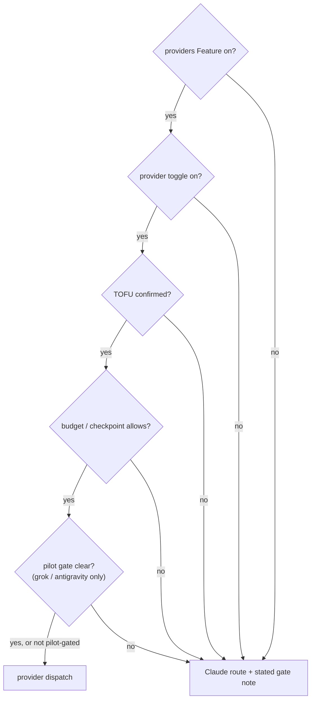
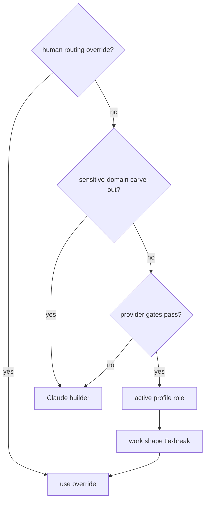
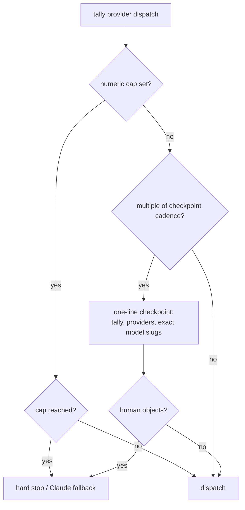
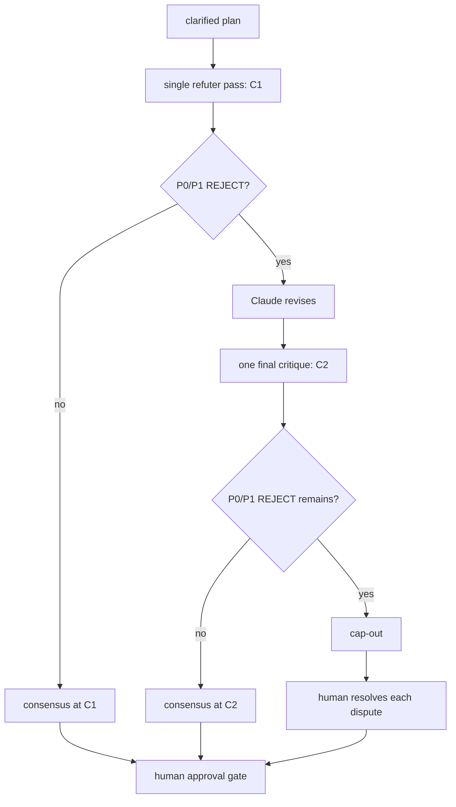
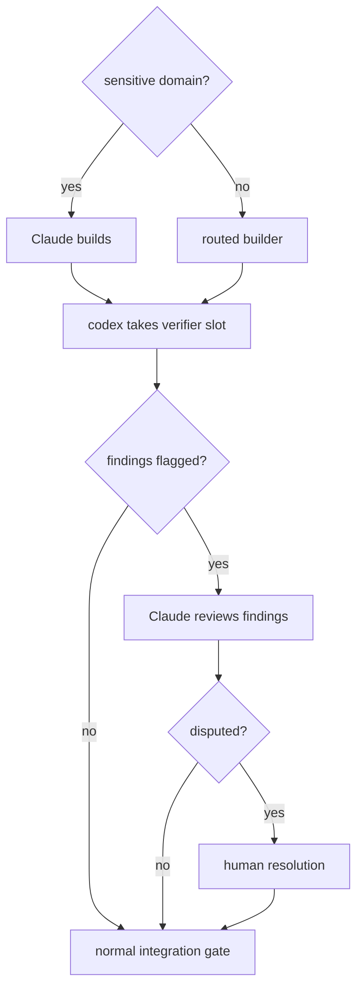

# Cross-model orchestration

Forge remains Claude-native at the kernel: it decides the loop, keeps the
record, and never treats a provider result as an automatic approval. When
external providers are enabled, they fill explicitly routed worker or judge
slots with a visible provider/model label. The dispatch label identifies the
standing-in persona, profile role, provider, exact model slug, and task name;
it is not a new provider-specific persona. Full label grammar lives in
[`docs/conventions/telemetry-and-labels.md`](../conventions/telemetry-and-labels.md).

## External-provider dispatch: gates before routing

A provider must clear four independent layers: the repo-wide Feature, its
own toggle, TOFU confirmation, and the budget/checkpoint decision. Pilot
providers add an independent pilot gate; a toggle never clears it. A blocked
route states the one gate that blocked it and degrades gracefully rather than
waiting silently. The provider gate contract is normative in
[`provider-judges.md`](../../skills/kernel/references/provider-judges.md).

*All provider gates must clear before a provider can fill a routed role.*

Source: `docs/diagrams/provider-gates-and-pilot.mmd`.

`/forge:settings` is the sole editor for the Feature, per-provider toggles,
and Budget keys. Its complete view and validation share one settings-schema
registry, so a key is defined once rather than independently in the UI and
validator. See
[`docs/conventions/config-and-features.md`](../conventions/config-and-features.md).

For every provider worker dispatch, attached skills are materialized into
the dispatch worktree before its prompt; this required attachment step does
not depend on native skill discovery. The materialized scratch area is
excluded at integration. Optional native discovery registration is a
human-run additive surface, never a substitute for materialization.

## Routing and the sensitive-domain carve-out

Routing honors a human-written override first. Without one, sensitive work
and provider-gate machinery default to an in-harness Claude builder. The
carve-out binds only the builder role: cross-model judging and second
opinions remain available. Otherwise, passing gates permit the active
profile role and work shape to resolve the builder.

*Human overrides take precedence; sensitive builder work stays in Claude by default.*

Source: `docs/diagrams/builder-routing-precedence.mmd`.

## Checkpoints, not an invisible default ceiling

The shipped default is a running tally with a checkpoint every ten provider
dispatches. At each checkpoint Forge reports the tally, per-provider counts,
and exact model slugs, then continues unless the human objects. A numeric
provider-dispatch cap remains a real hard stop; provider rate-limit errors
are surfaced verbatim.

*Checkpoints make provider use visible; an explicit numeric cap remains a hard stop.*

Source: `docs/diagrams/provider-checkpoint-budget.mmd`.

## Consensus and sequential review

Plan consensus is escalate-only: one refuter critique is the normal first
look. A clean `C1` ends review. A P0/P1 rejection triggers one Claude
revision and exactly one `C2`; any remaining dispute goes to per-decision
human resolution before the separate approval gate. Cosmetic findings are
fixed inline and do not create another round.

*Consensus gets one bounded escalation before unresolved decisions return to a human.*

Source: `docs/diagrams/plan-consensus-escalation.mmd`.

For a routed provider build, Claude remains the equal-or-higher verifier.
For Claude-built sensitive or full-tier work, codex takes the single verifier
slot and Claude reviews only the findings it raises; a dispute reaches a
human rather than silently favoring either model. Simultaneous dual
verification is an explicit command, not the default.

*Sequential review keeps a human as the tie-breaker when model judgments conflict.*

Source: `docs/diagrams/sequential-cross-model-review.mmd`.

Grouped verification remains the floor: related ready tasks can share one
verifier dispatch, but each receives its own verdict. The first adversarial
look is never skipped. After the initial pass and one delta re-verify,
further unresolved judgment becomes a human blocker; P3/cosmetic findings
are fixed inline rather than spending another verifier dispatch. See
[`docs/conventions/verification.md`](../conventions/verification.md).
