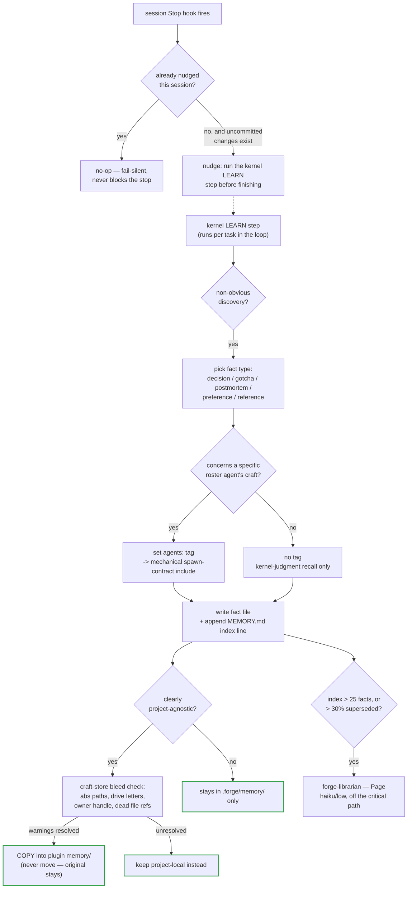

# Memory + craft store

Canonical format contract: [`docs/conventions.md`](../conventions.md),
"Project memory files" and "Memory — agents tag + craft memory
(2026-07-17)". Reading/searching operations:
[`skills/memory/SKILL.md`](../../skills/memory/SKILL.md).

Two stores, same shape (`MEMORY.md` index + one fact per `<type>-<slug>.md`
file), different scope:

- **Project memory** (`.forge/memory/`) — git-tracked with the repo,
  project-scoped, shared by every model/machine/agent working that repo.
- **Craft memory** (`<plugin-root>/memory/`) — git-tracked with the Forge
  plugin itself, **project-agnostic only** (environment gotchas,
  cross-project techniques, harness behaviors), ships to every project that
  installs Forge.

Facts are **never deleted.** An outdated fact gets `superseded-by:
<newer-file>`; the old file stays, so contradictions resolve without silent
loss (bitemporal-lite).

## Fact types

- **decision** — why X, including the reasoning and alternatives considered.
- **gotcha** — a trap that cost time.
- **postmortem** — mandatory whenever a task bounces twice; captures the
  reasoning, not just the outcome.
- **preference** — a standing project preference.
- **reference** — a durable pointer (doc, command, resource).

## Only the kernel writes

Only the kernel, at its LEARN step, writes to either store — consistent
with Hard Rule 4 (workers never touch `.forge/`, and memory lives under the
same root, or under the plugin root for craft memory). Any other agent that
surfaces a durable discovery reports it in its own output; it does not
write the fact file itself.

## Agent-tagged recall

A fact may carry an optional `agents:` field — a flat list of roster agent
names — meaning "this fact concerns that agent's kind of work." Untagged is
the default and stays fully usable; tagging is additive, never a
restriction. The mechanical consequence: **every spawn contract for a
tagged agent auto-includes that fact** in its context — this is mechanical,
not a router judgment call. Judgment-selected facts are added after, within
the contract's existing token budget; tagged facts get priority if trimming
is needed.

## The memory / learn loop

The Stop-hook nudge (`hooks/scripts/session-end-learn.sh`) is a reminder,
never the mechanism itself: it fails silent, never blocks the session end,
and is debounced once per session (a session idling between background
notifications stops many times; the nudge is only useful the first time).
The kernel's own LEARN step — which actually files facts — runs per task
inside the loop, not only at session end.

## Craft-memory bleed check

Craft memory is the one store shared across every project that installs
Forge, so nothing project-specific may ride along in a fact promoted there.
`tools/validate_memory.py` scopes a bleed check to craft-store facts only
and flags four patterns, each a **warning**, never an error: an absolute
filesystem path outside the plugin root; a drive-letter path pointing at
another local project; the repo owner's GitHub handle; and a repo-relative
file reference that doesn't exist under the plugin root. URLs are masked
out first, so a legitimate external cross-reference never trips these
checks. Promotion to craft memory requires resolving every bleed warning
first — fix the fact, or keep it project-local instead.

## Consolidation

The kernel's SYNC step spawns `forge-librarian` (Page, haiku/low) for a
consolidation pass when the `MEMORY.md` index exceeds 25 facts, or more
than 30% of its facts are tagged superseded — after the session's task
work, or at session start only if the queue is idle, **never inline with
task work**. Page dedupes overlapping facts, marks stale ones superseded,
and rebuilds the index — never deletes, never runs inside a task dispatch.
