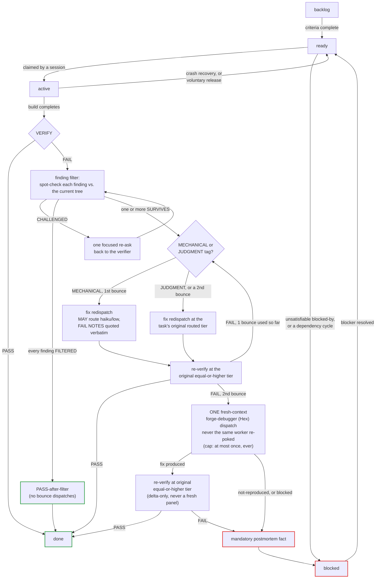

# Queue format + EARS, and the task lifecycle

Canonical format contract: [`docs/conventions.md`](../conventions.md)
("Task files"). This page is the narrative walkthrough plus the lifecycle
diagram; the frontmatter/body tables below are drawn directly from that
contract, not a paraphrase of it.

## Task files

One markdown file per task, flat under `.forge/queue/tasks/`, filename
`<id>-<slug>.md`. State lives in the frontmatter — **never** in folder
location.

| Frontmatter field | Values | Notes |
|---|---|---|
| `id` | `fg-[0-9a-f]{4,8}` | random; collision-checked |
| `title` | string | imperative, one line |
| `state` | `backlog \| ready \| active \| blocked \| done \| dropped` | |
| `tier` | `trivial \| standard \| full` | ceremony level |
| `priority` | `1 \| 2 \| 3 \| 4` | 1 = highest |
| `spec` | path or `null` | required non-null when `tier: full` |
| `blocks` / `blocked-by` | `[ids]` | dependency edges |
| `claimed-by` | `<session-id> @ <ISO-8601>` or `null` | non-null iff `state: active` |
| `parallel-safe` | `true \| false` | same-wave concurrency eligibility |
| `shard-by` / `max-shards` / `shard-key` | optional, additive | intra-task fan-out — see [Sharded fan-out](sharded-fan-out.md) |

Body, five required sections in this exact order: **Acceptance criteria**
(EARS clauses), **Execution plan** (`(pending)` until PLAN), **Routing
record** (one line per dispatch attempt), **Attempt log** (what happened,
including verifier verdicts and bounce notes), **Outcome** (filled at
INTEGRATE, or when blocked/dropped — the audit trail's conclusion).

## EARS acceptance criteria

Every task's Acceptance criteria section holds one or more EARS clauses in
the form `WHEN [trigger], THE SYSTEM SHALL [behavior]`. Each clause must be
checkable by a verifier or map to a test — a criterion nobody can check is
not a valid criterion. This is the same discipline the spec pipeline's
Acceptance criteria section requires (a spec's decomposition carries its
EARS clauses down into each derived task), so a task's criteria trace back
to the spec that authorized it whenever `tier: full`.

## The task lifecycle



Legal transitions only — the state machine has no other edges, and `done`
and `dropped` are terminal:

```
backlog → ready          criteria complete, ready to schedule
ready   → active         claimed by a session (write claimed-by)
ready   → blocked        blocked-by dependency became unsatisfiable
active  → done           verifier passed; Outcome written
active  → ready          unclaimed (crash recovery, or voluntary release)
active  → blocked        2 failed bounces, or external blocker
blocked → ready          blocker resolved (human or kernel)
any     → dropped        human decision only
```

The finding filter, the MECHANICAL/JUDGMENT bounce fork, and the
PASS-after-filter outcome are covered in full — including how the same
filter widens to the full-tier ship judges — on the
[verification economics page](verification-economics.md); this page states
only the shape of the lifecycle they plug into.

### Clean-context debug escalation — the step before `blocked`

Full rule text: [`docs/conventions.md`](../conventions.md), "Clean-context
debug escalation — 2026-07-18 (fg-a10701)". A task that FAILs verification
twice used to go straight to `blocked`; now the kernel spends one dispatch
first, giving `forge-debugger` (Hex) a genuinely fresh look at the failing
diff rather than sending the same worker back with the same notes it
already missed twice — the idea, adopted from a comparable harness's
auto-debug-on-second-reject pattern, being that a stuck reader rarely
un-sticks itself just by being asked again. The diagram above shows where
this fits in the lifecycle; see the convention for the exact dispatch
inputs and the cap on how many times it can fire.

### Human-readable task names

Canonical: [`docs/conventions.md`](../conventions.md), "Dispatch display
labels — task-name amendment — 2026-07-18". Every human-facing surface —
kernel narration, `/forge:status` rows, session reports, bounce
explanations, wave summaries — leads with the task's short human name, id
trailing in parens: "stop-hook quiescence (fg-a10906)", never a bare
`fg-xxxx`. The short name is the task's filename slug, or (when the
filename is id-only) the first ~6 words of the title. Ids stay the ONLY
join key everywhere load-bearing — filenames, frontmatter, `blocked-by`
edges, telemetry, grep, commits — because parallel sessions need
collision-free, rename-stable keys; this only changes what a human is
shown, never what machines match on.

## Waves

A wave is every `ready` task whose `blocked-by` ids are all `done`, ordered
priority-ascending then created-ascending. A batch of same-wave tasks
dispatches in **parallel** when eligible — ≥2 tasks, each
`parallel-safe: true`, no `blocked-by` edges among them, and non-overlapping
declared file scopes — sliding-window dispatched under `max-parallel-tasks`
(default 3, `forge.md` Queue section). Anything ineligible runs the
sequential fallback, one task at a time. See
[Configuration reference](configuration.md) for the Queue keys and
[Sharded fan-out](sharded-fan-out.md) for the intra-task version of this
same mechanism.
