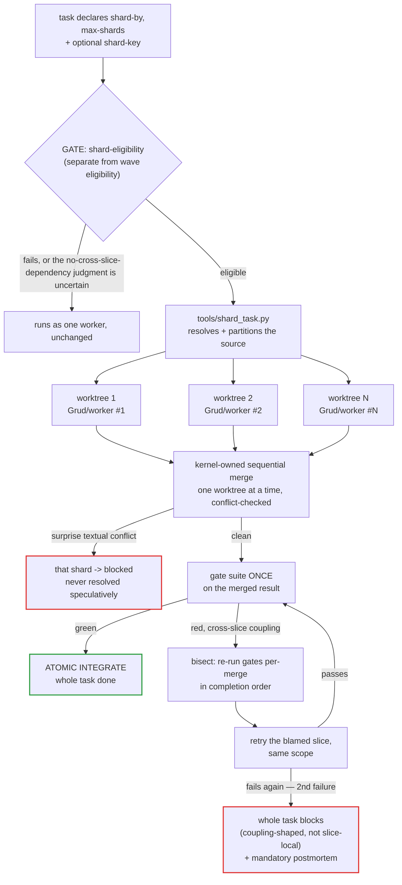

# Sharded fan-out

Canonical protocol: [`docs/conventions.md`](../conventions.md),
"Sharded fan-out — 2026-07-18" and "Grud routing (goblin grunt) —
2026-07-18". Mechanics: `skills/kernel/references/parallel-dispatch.md`
("Shard expansion", "Shard merge, verify, bisect, atomicity"). Splitter:
`tools/shard_task.py` (`split_shards`).

A single queue task can declare that it splits into N disjoint slices,
dispatched to N identical-slug workers, each in its own git worktree, then
merged and verified — **intra-task** fan-out. This is distinct from the
inter-task **parallel waves** covered on the
[queue + EARS page](queue-and-ears.md#waves): waves run N *different* tasks
concurrently; sharding turns *one* task into a swarm of copies of itself
over disjoint scope.

## Declaring a shard

Three optional, additive frontmatter fields — a task with none of them
validates exactly as before:

| Field | Values | Notes |
|---|---|---|
| `shard-by` | `files \| items \| ranges` | the split dimension; absent = not shardable |
| `max-shards` | integer ≥ 2 | upper bound on slice count |
| `shard-key` | scalar string | the source to resolve into atoms |

`shard-by`/`max-shards`/`shard-key` are orthogonal to `parallel-safe`: a
shardable task doesn't need `parallel-safe: true`, and a `parallel-safe`
task isn't automatically shardable.

## Shard-eligibility — separate from wave eligibility

Wave eligibility is a mechanical scope-overlap check. Shard eligibility adds
a conservative **judgment call** on top: `shard-by` present with
`max-shards` ≥ 2, the resolved source has ≥2 atoms, the splitter produces
provably disjoint slices, and — the part that isn't mechanical — **no
cross-slice dependency**: the task's criteria must not require slice *i* to
read slice *j*'s output. When uncertain, do **not** shard; a task may be
structurally eligible and still run un-sharded if that judgment can't be
made with confidence.

`shard-by: files` is further **restricted to provably per-file-local
operations** — formatting, header insertion, per-file codemods with no
cross-file signature change. A file set coupled through the build graph
(a signature change rippling to callers, a shared type touched from
multiple files) is textually-clean-but-semantically-broken when split by
file: each slice's diff looks correct in isolation, the scope is genuinely
disjoint, and the merge is conflict-free — but the merged *behavior* is
wrong in a way none of those structural checks catch, because they test
disjointness of text, not coupling of meaning. Build-graph-coupled file
sets must not be sharded by `files`.

## Grud (`forge-grunt`) — sharding's primary consumer

When shard work is fully specified with zero judgment left to apply — an
exact patch across many files, a literal string replace, a delete/move, a
reformat — it routes to **Grud**, always dispatched at haiku/low, with a
minimal system prompt and no craft skills attached. Grud is non-skillful by
design: cheap, and structurally unable to over-think a mechanical job,
because it has no craft skill to over-think it with. If a contract handed
to Grud requires any judgment call, Grud **refuses and bounces the whole
task back to the kernel unexecuted** rather than guessing.

The dividing line against `forge-migrator` (Tern) is judgment, not surface
area: Tern owns judgment about *what* to change (semantic-preserving
codemods, AST-aware renames, a sweep where each site needs its own
plausibility check); Grud only executes work that is already fully
specified. The two never overlap.

## Shard → dispatch → merge → verify → integrate

## Verification is skipped only under the existing Low-risk predicate

"Per-shard verifier spawns are optional for mechanical work" is **not** a
blanket exemption. A shard's per-slice verify may be skipped only when that
shard's own diff would independently qualify under the
[Low-risk verification predicate](verification-economics.md#the-three-verify-modes)
in full — every EARS clause pin-covered, no protocol-file touch, gates
cover the change. Gates-green ≠ acceptance-met holds at shard granularity
exactly as it holds at task granularity: a shard tasked with renaming `X` to
`Y` that instead *deletes* `X` passes every gate green (nothing references
the deleted symbol) while the EARS criterion goes unmet — only an
EARS-clause verifier reading the criterion against the diff catches this.
Grud/grunt shards inherit this rule explicitly: a mechanical-tier slug does
not get a looser verification bar than a standard-tier one.

## Atomicity — the opposite of a parallel-batch wave

Parallel-batch wave INTEGRATE is explicit that a batch is **not**
all-or-nothing: one wave task failing doesn't stop the rest. **Shard
INTEGRATE inverts that rule.** Because N shard-jobs are slices of *one*
task, not N independent tasks, the whole task is done, or the whole task is
blocked — there is no "drop the broken slice, integrate the rest," because
the slices are not independent deliverables; they are one deliverable in
pieces.

## Nesting, and what's deferred

A shardable task that is also an inter-task wave member is **supported by
schema and loop from day one**: both share the ONE sliding-window
concurrency cap, with at least one slot reserved per distinct wave task so
a task's shards can never starve its wave siblings of a dispatch slot.
"Allowed ≠ always-chosen" — the shard-eligibility predicate still applies
in full, and a structurally-eligible task may still run un-sharded when the
no-cross-slice-dependency judgment can't be made with confidence.

`shard-key: cmd: <command>` — enumerating a shard source by running a
command — is **deferred**, not shipped: v1 ships `inline-list` and glob
shard sources only, both with no execution surface. A `cmd:`-bearing task
merged into an already-trusted `.forge/` by a compromised collaborator
would dispatch on the next `continuous-loop` wave with no re-gate, which
the existing merge-widens-trust-blast-radius rule
([trust model](trust-model.md)) doesn't cover — so it stays out until that
gap has its own design.
