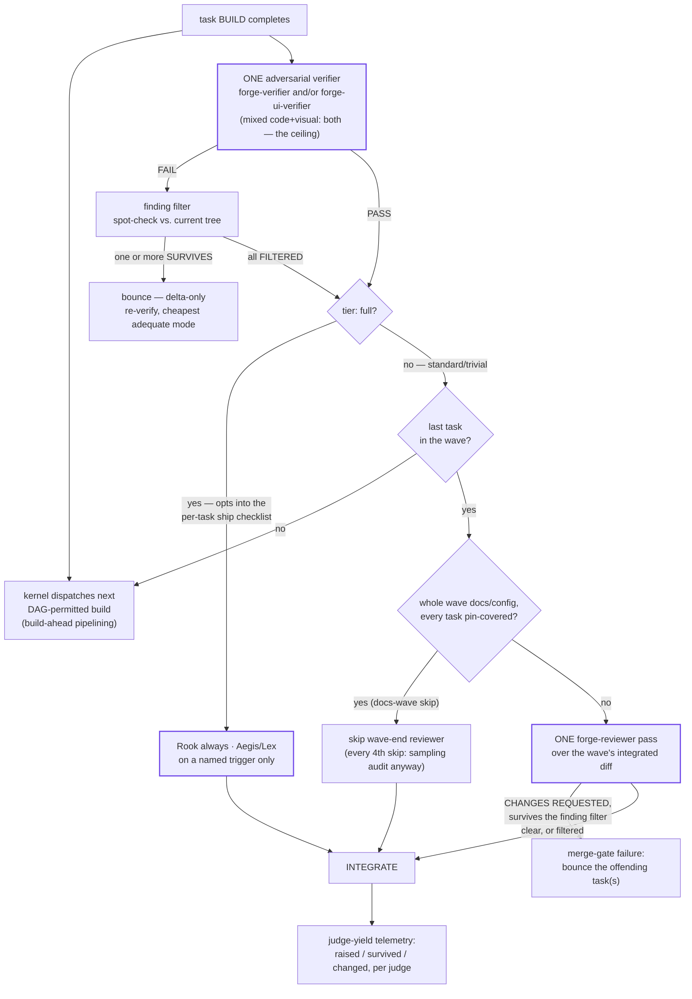
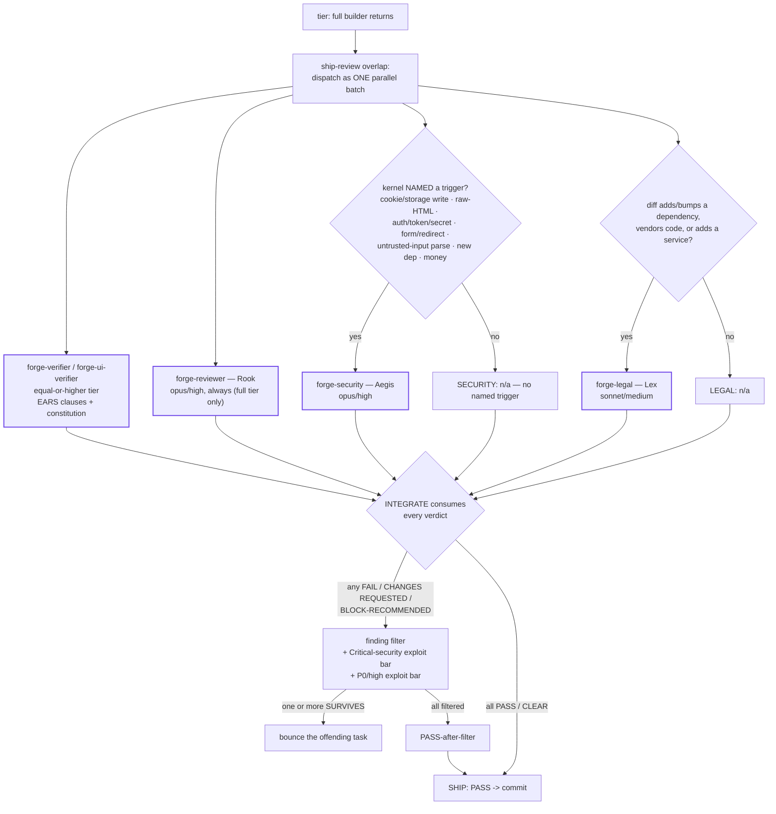

# Verification economics + the finding filter

Verification is the most expensive layer of the protocol, by design — this
page states what it costs, what it catches, and the two mechanisms built to
cut its cost, honestly, with real numbers from the project's own audit
rather than marketing language. Source:
[`docs/audits/2026-07-18-protocol-overhead-audit.md`](../audits/2026-07-18-protocol-overhead-audit.md)
(full manual read of 79 task files, cross-checked against
`tools/telemetry.py --json`). Every figure below is either traced to that
audit or explicitly labeled an estimate, exactly as the audit itself labels
its own numbers.

## What it costs

Under the audit's relative-cost model (illustrative weights, not measured
token counts — no per-spawn token accounting exists yet in the Attempt log),
**verification (first-pass verify + re-verify) accounts for roughly 60% of
total protocol spend** on the 52 tasks that went through an adversarial
verify gate. This is driven almost entirely by the equal-or-higher-tier
rule — a verifier is structurally pricier than the builder it checks — not
by the bounce rate: even a zero-bounce world would still pay this, because
a clean first-attempt PASS already buys a builder-plus-verifier cost pair.
Bounce-and-refix cycles themselves add only about 4% on top. The audit's
overall framing: Forge's protocol is **neither faster nor cheaper** than an
unsupervised single agent — it trades a measured **3-4× per-task cost
multiple** for a defect-catch rate the audit estimates at **15-30% of
verified tasks**, and that trade has not yet been validated against a true
single-agent control (`fg-a10210`, queued, not yet run as of the audit
date). Read this section as **insurance, not speed** — the protocol pays a
real, sizeable premium specifically to catch defects a single unsupervised
pass would plausibly have shipped, not to go faster.

Of the 16 verifier FAILs the audit read in full, roughly 9 carried a real
shippable defect (2 of those high-impact — one silently defeated a security
guard, the other silently defeated the verification system's own
integrity), about 4 were pure test-coverage/process catches with no
functional defect, 2 were vacuous-test meta-catches, and 1 was an outright
false positive that the finding filter caught at zero rework cost.

## The three verify modes

1. **Gates-inline** (trivial tier). The kernel runs the gate commands
   itself; no separate agent spawn.
2. **Verifier spawn** (standard/full, the default). `forge-verifier` (or
   `forge-ui-verifier` for rendered UI/motion output) runs at equal-or-higher
   model tier than the work it checks, judging every EARS clause with
   evidence and, when `.forge/constitution.md` exists, every numbered rule.
   This is the ONE adversarial verifier a task ever gets — see
   [Panel policy](#panel-policy--the-per-task-ceiling), below, for the
   per-task ceiling and how review/security join (or don't).
3. **Kernel synthesis** (report tasks only). A read-only "finder" task's
   report is judged by the kernel directly — no separate verifier spawn —
   valid only when the deliverable is the report itself, nothing else.

### Low-risk verification (standard sub-class)

A narrow, **conjunctive** reduction inside mode 2 — never a fourth mode —
for the slice of standard-tier work where a full adversarial pass is
disproportionate: a docs/config-only diff, zero runtime-behavior change,
every EARS clause already covered by a passing pin, and the task touches
NONE of `skills/`, `agents/`, `hooks/`, `workflows/`, or `.forge/` protocol
files. Normative prose — text stating a rule the system must follow — never
qualifies regardless of path, including this very rule's own section; UI or
animation output never qualifies, since rendered output is behavioral by
definition. When it qualifies, the kernel MAY route the verifier spawn to
haiku/low running a reduced checklist (gates green + every pin
present-and-passing + one adversarially spot-checked EARS clause). The
verifier returns `VERDICT: ESCALATE` — never a bounce, never a penalty —
the instant anything looks behavioral, unpinned, or doubtful, and the
kernel re-dispatches full verification. After 4 consecutive low-risk
passes, the 5th qualifying task runs full verification anyway (a sampling
audit).

**Honest status, per the overhead audit:** this sub-tier shipped in v0.7.6
and, as of the 2026-07-18 audit, **zero tasks had qualified for it** —
every task dispatched since either touched a disqualified path or edited
normative prose. The mechanism is sound (its own construction bug was
itself a genuinely valuable JUDGMENT-tagged catch), but its claimed savings
are, so far, entirely theoretical rather than realized.

## Panel policy — the per-task ceiling

Full rule text: [`docs/conventions.md`](../conventions.md), "Verification
economics — 2026-07-18 (fg-a10901)" — this page cites it rather than
copying it, since a future amendment to the trigger list or sampling
cadence should only ever need to change in one place. In one sentence: a
task gets at most one adversarial verifier, review moves from "every task"
to "once per wave" for anything short of `tier: full`, and security only
joins when the kernel names a specific reason — six mechanisms in total,
each targeting a concrete waste the ratifying forensic session measured
(the 16.5h frontend session cited in "What it costs," above, is the same
source). The diagram below is this page's own illustration of how those
mechanisms compose across a wave; read the convention itself for the
precise trigger list, the sampling cadence, and the re-derivation-owner and
judge-yield-telemetry details it defines.

## The finding filter — spot-check before you bounce

Before a verifier `FAIL` becomes a bounce, the kernel spot-checks **each**
finding in FAIL NOTES against the current tree: the cited file/location
must exist, and the claimed defect must reproduce on direct inspection.
This runs strictly before the MECHANICAL/JUDGMENT bounce-routing decision —
filter first, then route what survives.

- **SURVIVES** — the location exists and the defect reproduces; it goes
  into the bounce contract.
- **CHALLENGED** — ambiguous rather than clearly wrong; one focused
  clarification re-ask goes back to the verifier, never a fresh full pass.
- **FILTERED** — the defect does not reproduce; recorded in the Attempt
  log with the reason, never silently dropped.

If every finding in a FAIL filters, the verdict becomes **PASS-after-filter**
— no bounce dispatches — but `tools/telemetry.py` still counts it as a FAIL
verdict of record: the filter changes what the kernel does next, never what
the verifier said, so telemetry stays honest about verifier behavior
instead of laundering a FAIL into an invisible PASS.

**Honest status:** as of the overhead audit, this mechanism had **one**
measured real-world save (`fg-a10203` — 3 findings misattributed from a
concurrent kernel-inline rename, correctly filtered, zero rework). One data
point is not a trend, but it is the shape of the thing paying for itself.

## Ship-judge widening + the Critical-security exploit bar

The same filter widens to the full-tier ship judges: a `forge-reviewer`
CHANGES REQUESTED, a `forge-security` CHANGES REQUESTED, or a
`forge-legal` BLOCK-RECOMMENDED all pass through the identical
SURVIVES/CHALLENGED/FILTERED check before becoming a bounce. A
`forge-security` finding tagged **Critical** is held to a stricter bar:
the cited location existing is not enough for SURVIVES — the kernel must
attempt an actual reproduction/exploit before a Critical counts as
surviving. An inconclusive attempt is CHALLENGED, never FILTERED — doubt
keeps a Critical alive, it never silently dies. A `forge-legal` finding is
filtered narrower still: the kernel checks only that the cited source
(license text, manifest, notice) exists and says what the finding claims;
it never re-judges the underlying legal risk call, which stays with Lex and,
ultimately, the human deciding whether to accept, swap, or drop a flagged
dependency.

## P0-P3 severity + confidence on every finding

Full rule text: [`docs/conventions.md`](../conventions.md), "Finding
severity + confidence — 2026-07-18 (fg-a10911)". Every finding a judge
reports now carries a `P0|P1|P2|P3` severity plus a `confidence` level,
alongside (not replacing) its existing MECHANICAL/JUDGMENT tag — a signal
oh-my-pi's `/review` command inspired, borrowed because a bare
Critical/Important/Minor label doesn't say how ship-blocking a finding is
or how sure the judge is of it. The convention adds three coherence rules on
top so this new signal can't be gamed against the finding filter above: a
high-confidence P0 gets a stricter re-check before it's allowed to filter
out, a low-value finding can't singlehandedly trigger a bounce, and the
kernel's spot-check filter is barred from touching a judge's own severity
call. `tools/telemetry.py`'s `judge-yield` line (above) picks up an optional
per-severity count suffix as a direct consequence — see the convention for
the exact line grammar.

## Ship/judge panel flow (full tier)

`tier: full` is the opt-in to a per-task ship checklist — this is the ONE
case where Rook still runs per task rather than at wave end (see
[Panel policy](#panel-policy--the-per-task-ceiling), above). Standard-tier
tasks never see this flow; they get the wave-end reviewer pass instead.

All judges here are read-only against the same diff, so the parallel
dispatch carries zero integration risk — nothing one judge does can
invalidate what another reads. The done bar at INTEGRATE is unchanged by
running them in parallel: it still consumes every verdict, and any single
FAIL/CHANGES REQUESTED/BLOCK-RECOMMENDED among them fails the task exactly
as the fully-sequential protocol always specified. Only the wall-clock
ordering moved. Aegis's trigger question here is the SAME named-trigger list
[Panel policy](#panel-policy--the-per-task-ceiling) states for the wave-end
case — one list, two places it gates a dispatch.

## Verification infrastructure — what a panel member is handed

Full rule text: [`docs/conventions.md`](../conventions.md), "Verification
infrastructure — 2026-07-18 (fg-a10908)". Where panel policy (above) sets
WHO judges and WHEN, this convention sets what a judge is handed before it
starts — the fix for a live `forge-ui-verifier` run that spent over sixteen
minutes rebuilding scaffolding (an npm build, a hand-rolled test harness,
several server restarts) before any actual judging began, one of several
that same day repeating the pattern. In practice this means measurement
tooling gets committed and reused instead of hand-rolled fresh each time, a
wave shares one running build/server instead of each judge starting its
own, and every dispatch contract arrives pre-loaded with the files, tooling,
and prior measurements a judge needs rather than making it re-derive them.
See the convention for the exact dispatch-contract fields this requires.

## Recommendations the audit itself made

The audit's own recommendations, not yet all acted on: add per-spawn token
usage to the Attempt log (the single highest-leverage fix — turns every
estimate above into a measurement); extend `tools/telemetry.py`'s regexes
to stop under-reading roughly half the Attempt-log evidence it was built to
aggregate; run the queued A/B benchmark (`fg-a10210`) before making further
routing claims; track the low-risk sub-tier's qualification rate explicitly
rather than assuming a shipped-but-unused mechanism is paying for itself;
and do **not** widen the low-risk sub-tier's qualification rules just to
force more usage — its narrow, conjunctive bar is exactly what caught its
own construction bug.

## The A/B benchmark harness — built, not yet run

The harness the recommendation above calls for now exists at
`tools/benchmark/` (`runner.py`, `blinding.py`, `metrics.py`, `audit.py`,
plus a fixture package and frozen ground-truth checklists) — see
`tools/benchmark/README.md` for the full 8-step recipe: worktree both arms
from the same pinned commit, run the full Forge protocol against a
single-agent baseline on identical task briefs, normalize and blind both
arms' diffs, score them against a checklist frozen before either arm ran,
and report raw per-arm metrics under pre-registered decision rules — no
aggregate claim without the underlying rows.

**Honest status: the experiment has not run yet.** Everything above is the
harness's own design and its 8-task/2-per-class minimum scope, not a
result — this page's cost and defect-catch figures are still the forensic
audit's estimates, not this benchmark's measurements. A routing conclusion
from a future run reaches the runtime protocol only as an UNRATIFIED delta
filed to `docs/specs/2026-07-16-forge-design.md`'s Changelog — the same
human-gated channel telemetry-driven recommendations already use, never a
self-applied change.
