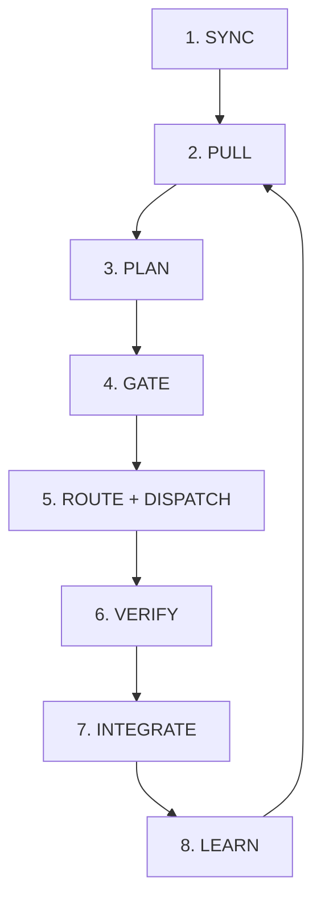
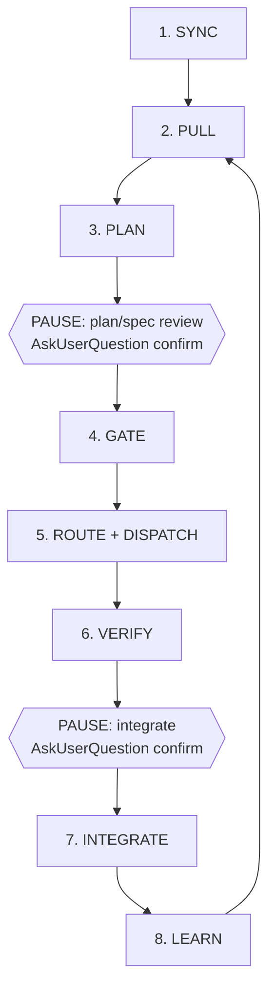
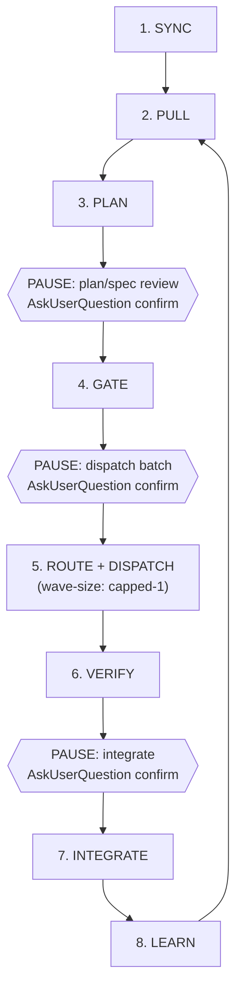

# Operator profile comparison

The three stock autonomy profiles Forge ships out of the box, side by side,
plus where each one's human-gate pauses sit in the kernel loop. Profile
*content* (key vocabulary, precedence, the shared container format) is
defined once and cited here, not restated:

- Container format, Meta keys, storage/immutability, delta-merge rule:
  [`skills/kernel/references/operator-profiles.md`](../skills/kernel/references/operator-profiles.md).
- `## Autonomy` domain key vocabulary and the three stock profile bodies
  below: same file, "Autonomy domain: stock profile content (fg-b0105)".
- Precedence order, floor enforcement, and exactly which kernel steps each
  `pause-points` value gates: [`skills/kernel/references/profile-wiring.md`](../skills/kernel/references/profile-wiring.md).
- Picking, switching, and creating a custom profile (the picker):
  [`commands/settings.md`](../commands/settings.md), step 2.

Values below are transcribed verbatim from `operator-profiles.md`'s stock
profile bodies — if this page and that file ever disagree, `operator-profiles.md`
is the source of truth.

## Comparison table

| | `full-auto` | `guided` | `high-touch` |
|---|---|---|---|
| **Pause points** | `none` | `plan`, `integrate` | `plan`, `dispatch`, `integrate` |
| **Wave size** | `unchanged` (no profile-imposed cap) | `unchanged` (no profile-imposed cap) | `capped-1` (every dispatch wave limited to one task) |
| **Verification panel** | `quiet` (no panel surfaced by default; verifier verdicts still gate INTEGRATE) | `summary` (verdict, severity counts, Critical/Important findings inline; full detail on request) | `full` (complete verifier findings panel — every severity tier, full diff context) |
| **Who it's for** | Existing installs mapping current (pre-profile) kernel behavior forward unchanged — a no-op overlay, not a new stance. Also the **existing-install default** when no `## Operator profile` section exists yet. | Full wave sizes, but a human reviews every plan and every integrate. The **fresh-install default**. | A human reviews one dispatch at a time, every stage, every wave capped to a single task. |

`pause-points` values name kernel loop stages, not tiers — a named pause
point fires at **every task tier** (trivial/standard/full), not only
`tier: full`'s pre-existing plan/ship-review steps
(`profile-wiring.md`, "Pause-point enforcement (all tiers)").

No profile setting — including `full-auto`'s `pause-points: none` — ever
relaxes the trust boundary's first-touch confirm, raises a human-set budget
cap, or skips the `tier: full` spec approval gate. Those three floors sit
above every profile unconditionally (`profile-wiring.md`, "Floor
enforcement (never relaxed)").

## Fresh-install vs. existing-install default

Per spec-4d2a resolved clarification #2: a fresh Forge install with no prior
`.forge/` state defaults to `guided`; an existing install that already has
`.forge/` state predating operator profiles defaults to `full-auto`
(`operator-profiles.md`, "Fresh-install vs. existing-install default").
Missing `## Operator profile` section in `.forge/forge.md` renders as
`(default — not yet in forge.md)` — same missing-toggle-means-default
convention the rest of `forge.md` uses.

## Gate-pause placement in the kernel loop

The kernel loop referenced below is `skills/kernel/SKILL.md`'s own numbered
steps: `1. SYNC`, `2. PULL`, `3. PLAN`, `4. GATE`, `5. ROUTE + DISPATCH`,
`6. VERIFY`, `7. INTEGRATE`, `8. LEARN`. `profile-wiring.md`'s "Pause-point
enforcement (all tiers)" section names the exact placement of each
`pause-points` value:

- **`plan`** — after step 3 (PLAN) writes a task's Execution plan, before
  step 4 (GATE) acts on it.
- **`dispatch`** — immediately before step 5 (ROUTE + DISPATCH) dispatches
  a batch (sequential or parallel-eligible alike).
- **`integrate`** — immediately before step 7 (INTEGRATE) commits a PASS
  and writes `state: done`.

One flowchart per shipped stock profile follows, each walking the same
eight-step loop with that profile's pause points marked as diamonds at the
exact boundaries above. A profile that doesn't mark a step shows the loop
flowing straight through it.

### `full-auto`

`pause-points: none` — no profile-added pause anywhere in the loop, beyond
the floors (trust boundary, budget caps, spec approval gate) that apply
unconditionally regardless of active profile.

### `guided`

`pause-points: plan, integrate` — the fresh-install default. Full wave
sizes; a human confirms the plan and confirms before every integrate.

### `high-touch`

`pause-points: plan, dispatch, integrate`, `wave-size: capped-1` — every
dispatch wave capped at one task, every stage reviewed. The wave-size cap
and the dispatch pause are two independent keys that compose, not one
setting implying the other (`operator-profiles.md`, stock profile
`high-touch`).

## Providers domain — status

The shared profile container reserves a second top-level `## Providers`
domain section alongside `## Autonomy`
(`operator-profiles.md`, "File shape" and "Providers domain: schema
(fg-c0101)") — **schema and stock content are shipped** (`enabled-providers`,
per-role assignment keys, provider tier-map keys, the `claude-only` /
`cross-check-second-judging` / `budget-tiers` presets), but **no dispatch
path reads it yet**. Honest status, not aspirational:

- Real dispatch through a `## Providers` profile is gated on `fg-c0106`
  (Phase 1 judge dispatch) and `fg-c0111`, both pending as of this page.
- Two independent gates sit above any `## Providers` profile content
  regardless of dispatch status: the `providers` Feature toggle
  (`.forge/forge.md`, OFF by default) and per-provider trust confirmation
  (`docs/conventions/trust-and-security.md`). Naming a provider in a
  profile is accepted and stored; it is not itself what enables dispatch.
- `grok` and `antigravity` additionally carry a pilot-evidence review gate
  independent of dispatch wiring (`operator-profiles.md`, "`##
  Providers` key vocabulary", `enabled-providers`); `codex` does not.

Until `fg-c0106`/`fg-c0111` land, `## Providers` content in any profile
file is inert — stored, validated structurally, never dispatched from.

## Picking, switching, or customizing a profile

Use `/forge:settings` — step 2 ("Profile picker") lists stock, preset, and
custom profiles side by side grouped by domain, switches the active pointer
with a one-line edit to `.forge/forge.md`'s `## Operator profile` section,
and walks copy-on-write customization when asked to customize an existing
profile. Full flow: [`commands/settings.md`](../commands/settings.md), step 2.
