# Releasing (private repo → public mirror)

Forge's working repo (`BenMacDeezy/forge-staging`) is private and keeps full project
state — `.forge/` (queue, specs, project memory), `docs/audits/`, everything.
The public mirror ships a filtered snapshot: just the plugin, LICENSE,
README, CONTRIBUTING, docs, and the project-agnostic craft-memory store
(`memory/` — see `docs/features/memory.md` on why that one *does* ship).

`tools/release.py` builds that filtered export and pushes it to the public
mirror as a single squashed commit tagged `v<version>`. It never creates the
mirror repo or touches git remotes — that's a one-time human step.

## The full flow, staging to a user's install

```mermaid
flowchart LR
    STAGING["BenMacDeezy/forge-staging<br/>staging branch (integration)"] -->|"green suite,<br/>merge to main"| MAIN["main<br/>release-ready at all times"]
    MAIN -->|"python tools/release.py"| ARCHIVE["git archive HEAD<br/>(committed state only)"]
    ARCHIVE --> DENY["denylist filter:<br/>.forge/, docs/audits/,<br/>tools/release-denylist.txt"]
    DENY --> SCAN["independent leak scan<br/>(2nd pass over the export tree)"]
    SCAN -->|"anything denylisted<br/>made it through"| ABORT["abort — nothing pushed"]
    SCAN -->|"clean"| PUSH["single fresh-history commit<br/>tagged v&lt;version&gt;,<br/>force-pushed to public/main"]
    PUSH --> MIRROR["BenMacDeezy/Orns-Forge<br/>(public mirror)"]
    MIRROR --> INSTALL["new user:<br/>marketplace add + plugin install"]
    MIRROR --> NUDGE["existing user:<br/>SessionStart update nudge<br/>(24h-throttled, version-compare only)"]
    NUDGE --> CMD["/forge:update<br/>marketplace update -> plugin update -> restart nudge"]

    classDef gate stroke:#e03131,stroke-width:2px;
    class ABORT gate;
```



The private repo's `staging` branch is where day-to-day work lands
(`CONTRIBUTING.md` §6); `main` only moves by merging a green `staging`, and
is what every release is cut from. Everything from the leak scan onward is
covered step-by-step below; the SessionStart nudge and `/forge:update` are
covered in full on [Update system](features/update-system.md) — this
diagram shows only where they sit relative to a release.

## Private-repo workflow: unchanged

Nothing here changes day-to-day development. Contributors keep working
against `BenMacDeezy/forge-staging` exactly as before — clone it, install it locally
per `CONTRIBUTING.md`, run the kernel loop, push to `main`. The release
script only runs when someone is cutting a public release; it is not part of
the regular commit/push cycle.

## One-time setup (maintainers only)

1. Create a public GitHub repo for the mirror (e.g.
   `https://github.com/<you>/forge-public`), empty, no README/license
   auto-init.
2. In your `BenMacDeezy/forge-staging` checkout, add it as a remote named `public`:
   ```
   git remote add public https://github.com/<you>/forge-public.git
   ```
3. That's it. `tools/release.py` uses this remote for every future release;
   it never creates it or reconfigures it.

Skip this if `git remote get-url public` already succeeds — `release.py`
tells you exactly this if the remote is missing, so you never have to
memorize it.

## Pre-first-release checklist (one-time, before the first public release)

`release.py` exports `.claude-plugin/` verbatim, so the public marketplace
identity has to be right before the very first release ships:

- [ ] `.claude-plugin/marketplace.json` names the public marketplace
  `orns-forge` (owner `BenMacDeezy`) — never the dev-only `forge-local` name.
- [ ] `tools/update_check.py`'s `MIRROR_URL` points at the real public
  mirror (`https://github.com/BenMacDeezy/Orns-Forge.git`), so the
  SessionStart update nudge activates.
- [ ] **One-time local migration for existing installs.** Anyone who
  already has Forge installed under the old `forge-local` marketplace name
  (including this machine's own dev install) must re-register it under the
  new name — nothing migrates automatically, and the running install keeps
  working under the old name until this is done. Verified against `claude
  plugin marketplace --help` / `claude plugin --help` on this machine (the
  removal verb is `remove`, alias `rm`):
  ```
  claude plugin marketplace remove forge-local
  claude plugin marketplace add /d/forge   # or the public mirror source, for a public install
  claude plugin install forge@orns-forge
  ```
  Then restart Claude Code — the newly-installed plugin only loads after a
  restart, same as any other plugin update.

## Cutting a release

From a clean `BenMacDeezy/forge-staging` checkout on `main`, with everything you want
in the release already committed:

```bash
# From Git Bash (see tools' general note: run Python tools from Git Bash,
# not PowerShell, on Windows hosts).
python tools/release.py --dry-run   # preview: prints the exact file manifest
python tools/release.py             # builds, leak-scans, and pushes the release
```

What happens, in order:

1. **Dirty-tree check.** Releases are cut from committed state only. Any
   uncommitted change (tracked or new) aborts the release before anything
   else runs.
2. **Version read.** The release tag is `v<version>`, where `<version>`
   comes straight from `.claude-plugin/plugin.json`'s `"version"` field —
   bump that first if you're releasing a new version.
3. **Filtered export.** `git archive HEAD` (never the working tree) is
   extracted into a temp directory, dropping every path under `.forge/`,
   `docs/audits/`, and anything listed in `tools/release-denylist.txt`.
4. **Leak scan.** An independent second pass re-walks the resulting export
   tree and checks every path against the same denylist. If anything
   denylisted made it through step 3 anyway (i.e. a bug in the filter), the
   release aborts here — **nothing is pushed**.
5. **`--dry-run` stops here**, printing the full file manifest so you can
   eyeball exactly what would ship.
6. **Remote + tag checks.** If the `public` remote isn't configured, or the
   tag `v<version>` already exists on it, the release aborts with an
   explanation and exits nonzero. Existing releases are never overwritten.
7. **Push.** The filtered tree becomes a single new commit (squashing away
   all private history) and is force-pushed to `public`'s `main` branch,
   then the `v<version>` tag is pushed. The public `main` branch always
   holds exactly one commit — the release history lives in the tags, not in
   accumulated commits.

## What ships vs. what doesn't

| Ships | Excluded |
|---|---|
| `LICENSE`, `README.md`, `CONTRIBUTING.md` | `.forge/` (queue, specs, project memory, config) |
| `memory/` (craft memory — project-agnostic lessons) | `docs/audits/` |
| `skills/`, `agents/`, `commands/`, `tools/`, `docs/` (minus `docs/audits/`) | anything added to `tools/release-denylist.txt` |

To exclude something new, add a line to `tools/release-denylist.txt` (one
path prefix per line, relative to repo root, `#` for comments) — see
`tools/test_release.py` for how the denylist is pinned and tested.

## Installing from the mirror (public users)

Public users never touch this script — they add the mirror as a Claude Code
marketplace and install the plugin from it. See the "Install" section of
`README.md` for the exact commands, and `CONTRIBUTING.md` for the separate
contributor/local-clone path.

## Staying current after install

Once installed from the mirror, a user doesn't need to track releases by
hand: a throttled SessionStart nudge tells them when a newer tagged release
exists, and `/forge:update` runs the actual update through the real Claude
Code plugin manager. Neither piece talks to this release script — they read
the mirror's tags after the fact. Full behavior, including the version-
compare security floor and why both pieces are silent no-ops before a
mirror URL is configured: [Update system](features/update-system.md).
