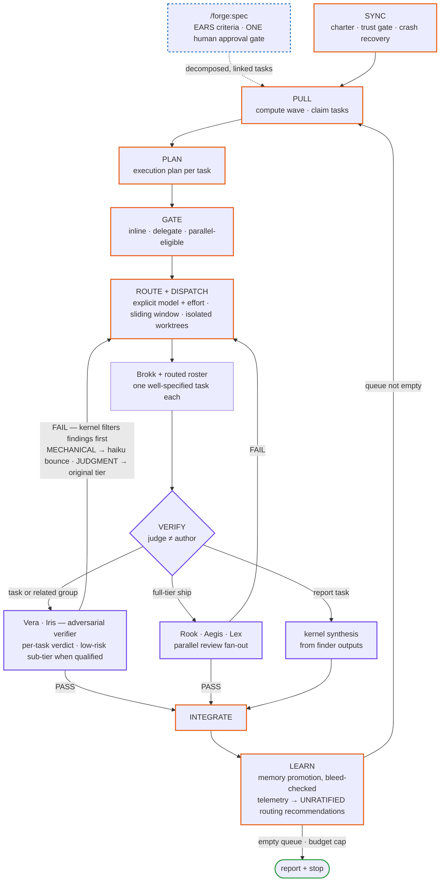

# Forge systems overview

Forge is a markdown-defined development system: a kernel moves approved work
through a queue, explicitly routes builders and judges, then keeps the useful
lessons. This page is the public map of those systems; the linked feature
guides provide the operational detail.

## Orchestration and work intake

| System | What it does | Entry points and deeper reading |
|---|---|---|
| Kernel loop | Synchronizes project context, claims ready work, plans, routes, verifies, integrates, and learns until it reaches a stop condition. | `/forge:start`; [architecture](architecture.md) |
| Spec pipeline | Turns an idea into EARS criteria, receives one human approval, then decomposes the result into linked full-tier work. | `/forge:spec`; [architecture](architecture.md) |
| Queue & EARS | Stores one task per markdown artifact, with a visible lifecycle and acceptance clauses that can be independently checked. | `/forge:add`, `/forge:edit`, `/forge:cancel`, `/forge:status`; [queue + EARS](features/queue-and-ears.md) |
| Routing & dispatch | Selects an appropriate role, model, and effort for each task and records that choice before work begins. | `/forge:start`, `/forge:settings`; [configuration](features/configuration.md) |
| Sharded fan-out / workflow executor | Splits eligible independent work into isolated slices and uses deterministic workflow execution when the harness supports it. | `/forge:blueprint`, `/forge:start`; [sharded fan-out](features/sharded-fan-out.md) |

## Verification and safety decisions

| System | What it does | Entry points and deeper reading |
|---|---|---|
| Grouped verification | Lets related tasks share an adversarial review pass while retaining a verdict for every task; low-risk work still receives an independent verifier. | `/forge:verify`, `/forge:start`; [verification economics](features/verification-economics.md) |
| Marginal-gain stop rules | Bounds retries, delta re-verification, and reviewer passes so more checking must still earn its cost. | `/forge:start`; [verification economics](features/verification-economics.md) |
| Ship protocol | Runs the full-tier verification panel and integrates only after required verdicts and gates pass. | `/forge:verify --full`, `/forge:start`; [verification economics](features/verification-economics.md) |
| Inquest tribunal | Separates broad finding, adversarial refutation, and final judgment for a deep, human-invoked investigation. | `/forge:inquest`, `/forge:court`; [inquest tribunal](features/inquest.md) |
| Trust boundary | Treats unfamiliar repository-supplied state cautiously and keeps human confirmation in the path before it can influence execution. | `/forge:onboard`, `/forge:start`; [trust model](features/trust-model.md) |

## Providers and autonomy

| System | What it does | Entry points and deeper reading |
|---|---|---|
| External providers & cross-model orchestration | Allows providers only in explicitly routed roles after feature, provider, trust, budget, and pilot checks; the kernel remains the decision maker. | `/forge:settings`, `/forge:dualverify`; [cross-model orchestration](features/cross-model-orchestration.md) |
| Autonomy & control | Offers hands-on through standing autonomy while preserving approval, budget, and safety gates at every level. | `/forge:settings`, `/forge:start`; [autonomy and control](features/autonomy-and-control.md) |

The seven workflow diagrams are rendered in their feature guides: the
[autonomy dial](features/autonomy-and-control.md#the-autonomy-dial),
[loop catalog](features/autonomy-and-control.md#loop-catalog),
[provider gates](features/cross-model-orchestration.md#external-provider-dispatch-gates-before-routing),
[builder routing](features/cross-model-orchestration.md#routing-and-the-sensitive-domain-carve-out),
[provider checkpoints](features/cross-model-orchestration.md#checkpoints-not-an-invisible-default-ceiling),
[plan consensus](features/cross-model-orchestration.md#consensus-and-sequential-review), and
[sequential cross-model review](features/cross-model-orchestration.md#consensus-and-sequential-review).

## Project knowledge and discovery

| System | What it does | Entry points and deeper reading |
|---|---|---|
| Memory (project + craft) | Retains project-specific decisions alongside reusable craft lessons; facts are superseded rather than silently discarded. | `/forge:memory`; [memory + craft store](features/memory.md) |
| Repo map | Produces a concise, refreshable orientation map so work begins from documented architecture and conventions. | `/forge:map`; [architecture](architecture.md) |
| Scout & onboard | Onboards a repository end to end and evaluates possible capabilities as proposals rather than automatic installs. | `/forge:onboard`, `/forge:scout`, `/forge:equip`; [architecture](architecture.md) |
| Agent factory & roster | Defines specialized, explicitly routed roles and can mint or enrich project-specific agents for recurring work. | `/forge:agent`, `/forge:seed`; [agent roster](features/roster.md) |
| Skill libraries | Supplies reusable expertise for frontend/animation, mobile, backend/data (including scaling architecture), and legal/compliance work. | Routed by the kernel and roster; [agent roster](features/roster.md) |

## Interfaces, maintenance, and distribution

| System | What it does | Entry points and deeper reading |
|---|---|---|
| Commands surface | Provides the human-facing slash-command doors for intake, execution, inspection, configuration, and maintenance. | `/forge:onboard`, `/forge:spec`, `/forge:add`, `/forge:start`, `/forge:status`; [documentation index](README.md) |
| Hooks | Adds small advisory session and lifecycle nudges while keeping the primary protocol usable without them. | Session lifecycle; [conventions corpus](conventions.md) |
| Dev tools / validators | Offer zero-dependency checks and supporting utilities that accelerate, but do not replace, the markdown protocol. | `python tools/validate_all.py`; [conventions corpus](conventions.md) |
| Release / distribution | Publishes a filtered public mirror and supports an explicit, user-controlled update path. | `/forge:update`; [releasing](releasing.md) and [update system](features/update-system.md) |
| Telemetry & Evolve | Aggregates execution evidence into routing recommendations that stay advisory until a human ratifies a change. | `/forge:telemetry`; [telemetry + Evolve](features/telemetry-and-evolve.md) |
